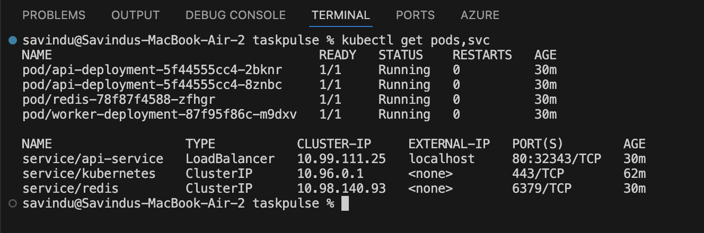
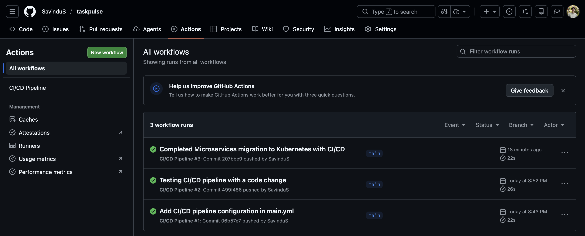
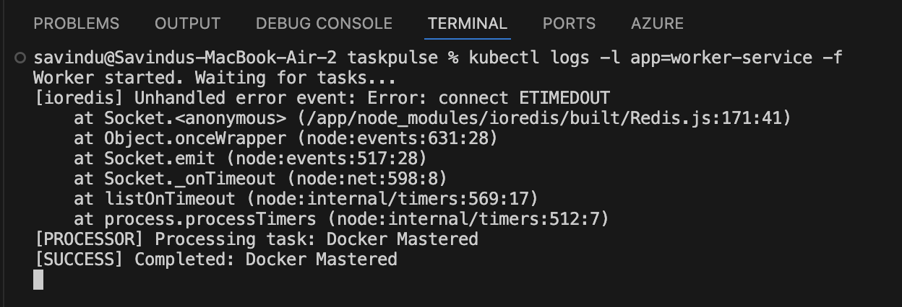

# TaskPulse: Distributed Asynchronous Task Pipeline

**TaskPulse** is an end-to-end DevOps project featuring a **Node.js microservices architecture**. It demonstrates the complete lifecycle of a modern, scalable application from local development with **Docker** to production-grade orchestration using **Kubernetes**.

---

## 🛠 Tech Stack

*   **Backend:** Node.js (Express)
*   **Message Broker:** Redis (Asynchronous Task Queue)
*   **Containerization:** Docker & Docker Compose
*   **Orchestration:** Kubernetes (Pods, Deployments, Services)
*   **CI/CD:** GitHub Actions (Automated Build Pipeline)

---

## 🚀 Key Features

*   **Microservices Architecture:** Completely decoupled **API** and **Worker** services for better maintainability and fault tolerance.
*   **Asynchronous Processing:** Leverages **Redis** to handle background tasks, ensuring the API remains responsive under high load.
*   **Infrastructure as Code (IaC):** Kubernetes manifests define the desired state of the infrastructure for repeatable deployments.
*   **High Availability & Self-Healing:** Configured with **multiple replicas** in Kubernetes, featuring automatic pod recovery and load balancing.
*   **Automated CI Pipeline:** Fully automated Docker build and validation process triggered on every code push via **GitHub Actions**.

---

## 📸 System Overview

### 1. Kubernetes Infrastructure
**Kubernetes Pods Status:** All services (API, Worker, and Redis) running successfully within the cluster with multiple replicas for the API service.

> 

### 2. CI/CD Pipeline (GitHub Actions)
**GitHub Actions Success:** Automated builds and environment validation passing on every push to the main branch.

> 

### 3. Application Flow & Logs
**Distributed Processing:** Live logs showing the API service receiving requests and the Worker service processing tasks asynchronously from the Redis queue.

> 

---

## 🏗 Setup & Installation

### **Prerequisites**
*   Docker Desktop (with **Kubernetes** enabled)
*   Node.js & Git

### Step 1: Clone the repository**
```bash
git clone https://github.com/SavinduS/taskpulse.git
cd taskpulse
```
### Step 2: Run with Docker Compose (Local Development)
```bash
docker compose up --build
```
### Step 3: Deploy to Kubernetes (Orchestration)
```bash
kubectl apply -f k8s/
```
### Step 4: Verify Deployment
```bash
kubectl get pods
kubectl get services
```
